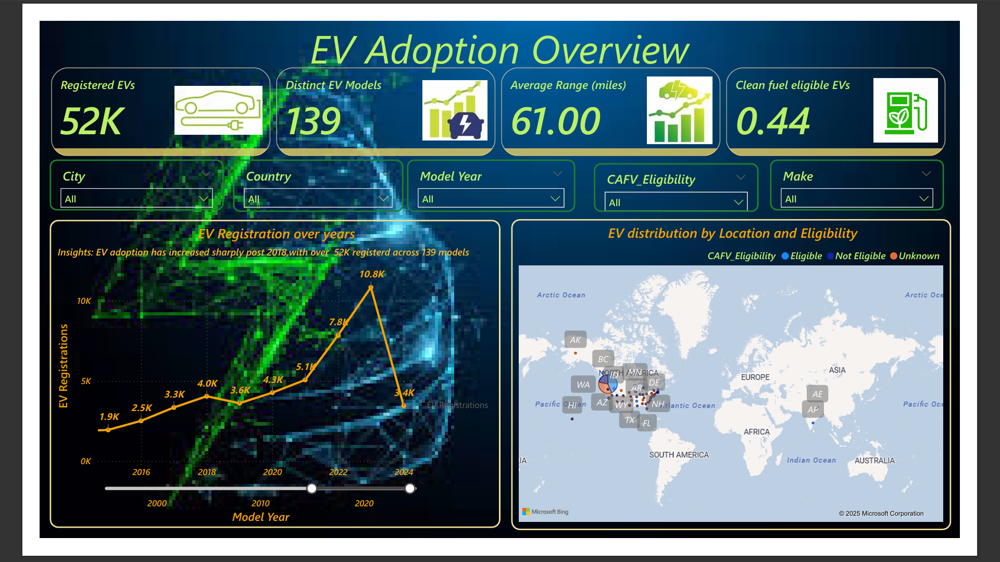
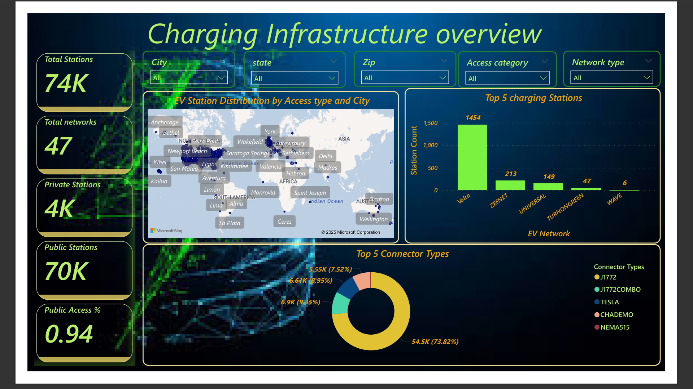
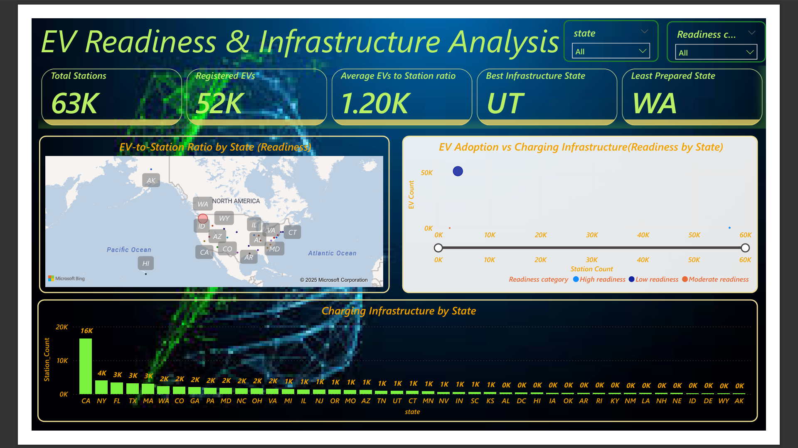
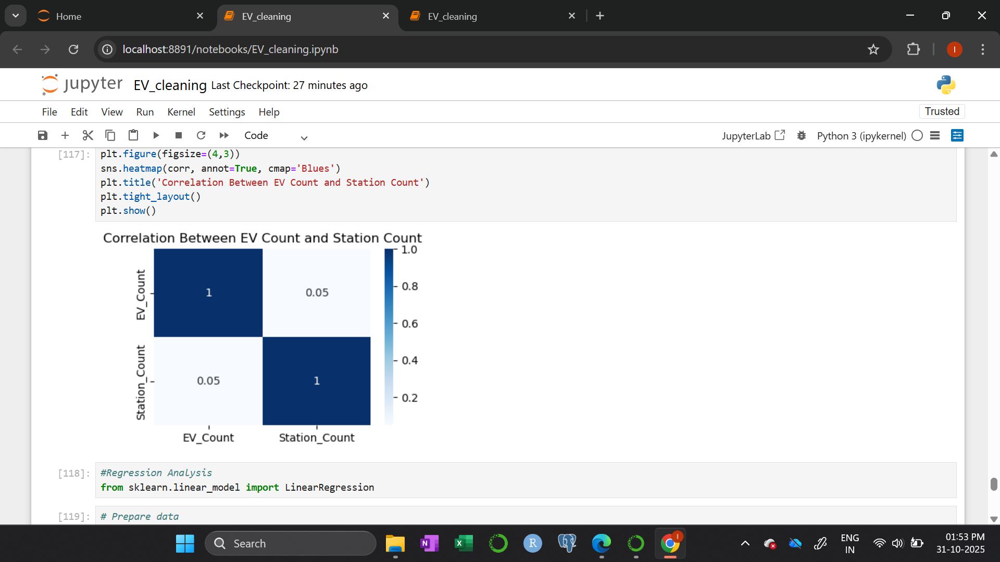

#  Electric Vehicle (EV) Analysis | Python + Power BI

##  Project Overview
This project presents an **end-to-end data analytics workflow** analyzing **Electric Vehicle (EV) adoption and charging infrastructure** in the U.S.  
It combines **Python** for data cleaning and transformation with **Power BI** for creating interactive dashboards.  

The objective is to understand the current state of EV adoption, evaluate charging infrastructure readiness, and derive insights into clean energy adoption trends.

##  Objectives
- Clean and preprocess EV and charging station datasets using Python (Pandas).  
- Create derived variables such as **EV-to-Station Ratio** and **Readiness Category**.  
- Analyze EV adoption patterns across states and years.  
- Visualize **charging infrastructure distribution** and **state readiness levels** using Power BI.  

---

##  Data Cleaning (Python)

**Tool:** Jupyter Notebook (exported as `EV_cleaning.ipynb`)  
**Libraries Used:** `pandas`, `numpy`, `matplotlib`, `seaborn`

### Key Steps:
- Imported raw EV dataset and charging station dataset.  
- Handled missing values and formatted numerical columns.  
- Standardized column names (e.g., `Station_Count`, `EV_Count`, `CAFV_Eligibility`).  
- Merged EV adoption and charging infrastructure datasets on **State**.  
- Calculated:
  - `EV_to_Station_Ratio = EV_Count / Station_Count`
  - `Readiness_Category` based on percentile thresholds.
- Exported cleaned dataset for Power BI visualization.

 **Notebook:** [EV_cleaning.ipynb](Python/EV_cleaning.ipynb)

---

## 📊 Visualization (Power BI)

**Tool:** Power BI Desktop  
**File:** [Electric_vehcile.pbix](Dashboard/Electric_vehcile.pbix)  

### Dashboard Sections

####  **EV Adoption Overview**
- **Registered EVs:** 52K  
- **Distinct Models:** 139  
- **Average Range:** 61 miles  
- **CAFV Eligibility:** 44% clean fuel vehicles  
- Insights: EV registrations increased sharply after 2018, crossing **52K vehicles across 139 models**.

####  **Charging Infrastructure Overview**
- **Total Stations:** 74K  
- **Public Access:** 94%  
- **Top Charging Networks:** Volta, ZEFNET, Universal, TurnOnGreen, WAVE  
- **Top Connector Types:**  
  - J1772 – 73.8%  
  - J1772Combo – 9.3%  
  - Tesla – 8.9%  
  - CHAdeMO – 7.5%

#### **EV Readiness & Infrastructure Analysis**
- **Total Registered EVs:** 52K  
- **Total Stations:** 63K  
- **Average EV-to-Station Ratio:** 1,200  
- **Best Prepared State:** Utah (UT)  
- **Least Prepared State:** Washington (WA)  
- Readiness visualized via **EV-to-Station Ratio** and **State-Level Categories (High, Moderate, Low)**.

**Dashboard Report (PDF):** [Electric_vehcile.pdf](Report/Electric_vehcile.pdf)
** Dashboard Preview**

   
 

  > 

   

  <em>Correlation Between EV Count and Station Count</em> 

---

##  Key Insights
- **Post-2018 surge:** EV registrations show exponential growth since 2018.  
- **Infrastructure gap:** Some states have strong EV adoption but limited charging stations.  
- **High Readiness States:** Utah, California, Texas, Florida.  
- **Low Readiness States:** Washington, Alaska, Wyoming.  
- **Network dominance:** Volta and ZEFNET lead charging station coverage.  

---

## Skills & Tools Demonstrated
| Skill / Tool | Description |
|---------------|--------------|
| **Python (Pandas, NumPy, Seaborn)** | Data cleaning and feature engineering |
| **Power BI Desktop** | Interactive data visualization |
| **Data Integration** | Merging multi-source datasets (EV + Infrastructure) |
| **Data Storytelling** | Transforming analytics into actionable insights |

---

## Learnings
- Enhanced ability to integrate **Python preprocessing with Power BI dashboards**.  
- Improved understanding of **EV ecosystem and infrastructure readiness**.  
- Strengthened data storytelling and presentation for analytical insights.  

---

## Future Enhancements
- Include **real-time EV registration APIs** for dynamic dashboards.  
- Add **geospatial heat maps** to visualize EV density by city.  
- Integrate **forecasting models** for EV growth prediction.

---

## Author
**Insherah Majid**  
🎓 B.Tech in Information Technology  
📊 Data Analyst | Python | Power BI | SQL  
📍 Srinagar, Kashmir  

🔗 [LinkedIn](#) ()  
📧 insherahmajid81@gmail.com

---

## Feedback
If you found this project useful or insightful, please ⭐ **star this repository** and connect with me on LinkedIn!  

---

🟢 *An end-to-end Electric Vehicle Analysis Project integrating Python data cleaning and Power BI storytelling for EV readiness insights.*

